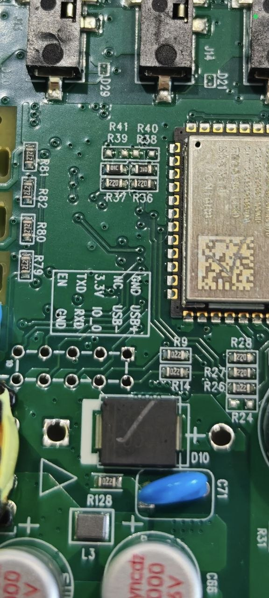
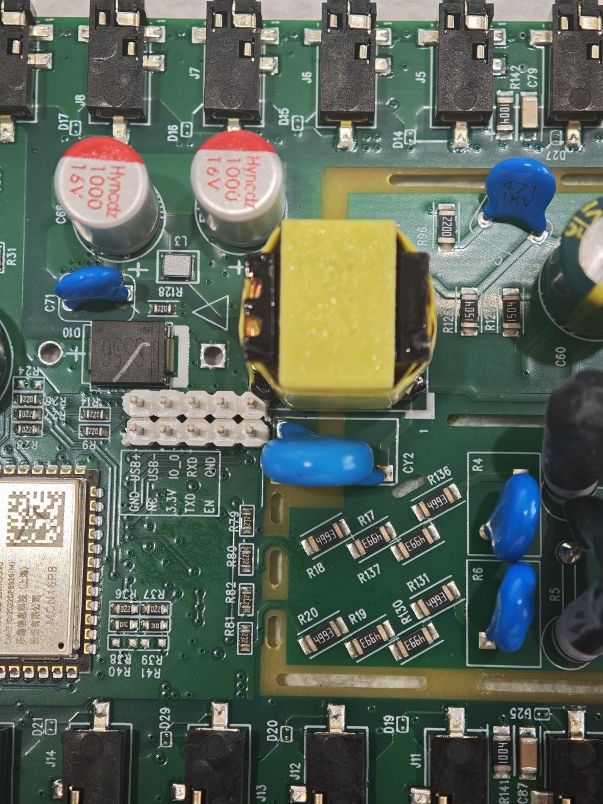

# SEM Meter Hardware Guide

## Electrical safety

The SEM Meter is mains-connected equipment. Disconnect it from mains power and
all monitored circuits before opening the enclosure, soldering, or attaching a
programmer. Serial development must use regulated 3.3 V power and 3.3 V logic.
Never connect 5 V to the board.

Only qualified people should work on exposed mains equipment. Reinstall the
board in its enclosure before normal operation.

## Board overview



*Factory SEM Meter board showing the location of the ESP32-S3 module and
programming header.*

Visible areas in the photograph include:

- **ESP32-S3 module:** the metal-shielded module near the programming pads.
- **Programming pads:** the unpopulated two-row footprint next to the module on
  a factory board.
- **Power-supply section:** the area around the yellow transformer, large
  capacitors, and blue components.
- **Current-transformer connections:** the black input connectors around the
  board perimeter accept the external current-transformer leads.

Do not infer electrical isolation or safe touch points solely from the
photograph.

## Development programming header



*Programming header installed on the development board. This header was added
during reverse engineering and firmware development. Factory boards normally
do not include this header.*

The project developer soldered a standard 2.54 mm header onto the factory
programming pads. Production boards do not normally include this header.

## Installing the header

The header shown in the photographs was soldered by the project developer
during reverse engineering and firmware development. Factory boards are
supplied with programming pads rather than this header.

If a header is required, disconnect every power source before soldering and
confirm the footprint against the PCB silk screen. Only `3.3V`, `GND`, `TXD`,
`RXD`, `IO0`, and `EN` are needed for the documented firmware-development
workflow.

Only these signals are required for firmware development:

- `3.3V`
- `GND`
- `TXD`
- `RXD`
- `IO0`
- `EN`

Always identify them from the PCB silk screen on the board being programmed.
The surrounding footprint includes other labels; those are not required for
the documented serial procedure.

Approximately **3.26 V** was measured between the pads marked `3.3V` and `GND`
while the development board was normally powered. This observation does not
make any other pad a power input, and there is no documented 5 V programming
input.

## Programming-header annotation

The planned annotated asset is:

```text
docs/images/programming-header-labeled.png
```

It is intentionally not included yet because the supplied photograph does not
provide enough certainty to place every arrow without risking an incorrect pin
assignment. A future verified annotation must use the PCB silk screen and
contain arrows pointing to:

- `3.3V`
- `GND`
- `TXD`
- `RXD`
- `IO0`
- `EN`

Do not publish an annotated pinout based on visual guesswork.

## CH340 connection

Use a CH340 adapter configured for 3.3 V:

| CH340 | SEM Meter |
|-------|-----------|
| 3.3V | 3.3V |
| GND | GND |
| TX | TXD |
| RX | RXD |

Warnings:

- The CH340 voltage selector **must** be set to 3.3 V.
- Never connect 5 V to the board.
- Verify every connection against the PCB silk screen.
- Disconnect power before changing IO0, EN, or serial wiring.
- Avoid powering the board simultaneously from multiple supplies.

The same-name TX-to-TXD and RX-to-RXD connection shown above is the wiring
documented for this board. Do not substitute a generic crossed-UART diagram
without checking the actual adapter and PCB labels.

## ESP32-S3 and antenna

The board uses an ESP32-S3-WROOM-1U. The `-1U` variant requires an external
2.4 GHz antenna. Install a compatible antenna securely before evaluating
Wi-Fi, API, web-server, or OTA reliability.

## Meter interface

The metering controller sends data to ESP32 GPIO39 at 115200 baud, 8N1. This
UART is the meter data interface; the programming header is used for ESP32-S3
bootloader and serial recovery. See [protocol.md](protocol.md) for the decoded
meter stream and [programming-reference.md](programming-reference.md) for a
bench reference.
