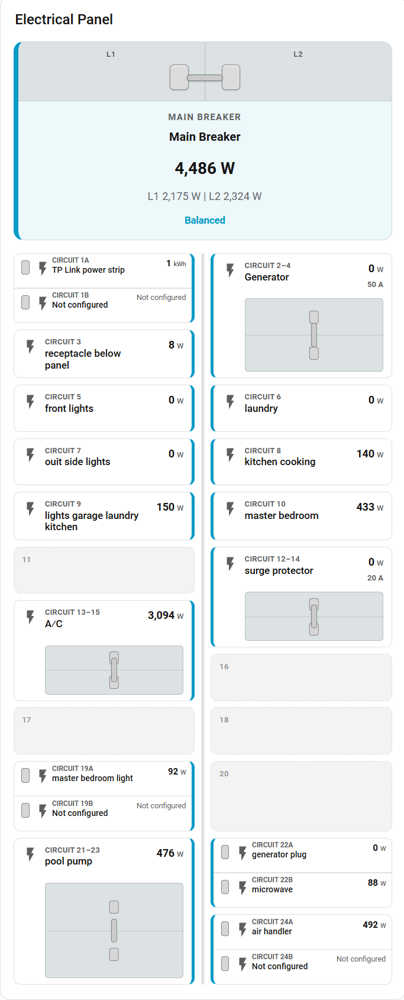

# SEM Electric Panel Card

Experimental Version 1 Home Assistant Lovelace card for the SEM Meter. It
renders one main electrical service and up to the hardware maximum of 16
current-transformer clamps as a residential two-column breaker panel.

<p align="center">
  
</p>

The card is plain JavaScript. It has no npm, bundler, CDN, or external runtime
dependency and does not communicate with the ESPHome device directly.

## Hardware limit

SEM Meter hardware supports no more than 16 clamps. Clamp numbers outside
1–16 are ignored, and duplicate clamp numbers are discarded after the first
valid entry. A double-pole row is visual metadata for one clamp; it does not
consume or create another clamp.

## Installation

1. Create this directory in the Home Assistant configuration folder:

   ```text
   /config/www/sem-electric-panel-card/
   ```

2. Copy `sem-electric-panel-card.js` into that directory.
3. In Home Assistant, open **Settings → Dashboards → Resources**.
4. Add this resource:

   ```text
   /local/sem-electric-panel-card/sem-electric-panel-card.js
   ```

5. Select resource type **JavaScript Module**.
6. Reload the browser. If the card does not appear, perform a hard refresh or
   clear the Home Assistant frontend cache.

The Lovelace card type is:

```yaml
type: custom:sem-electric-panel-card
```

This Version 1 release is not packaged for HACS.

## Graphical editor

After registering the resource:

1. Edit a dashboard.
2. Select **Add card**.
3. Find **SEM Electric Panel** in the card picker.
4. In **SEM Meter Device**, select one of the automatically detected SEM Meter
   candidates.
5. Choose an import mode and select **Import SEM Meter Entities**, or configure
   the entities manually.
6. Configure Display Settings and Main Breaker.
7. Expand **Clamp assignments** to review the 16 stable SEM measurement
   channels and their physical circuit positions.
8. Use **Physical Panel Positions** to select and edit any position through the
   configured panel size, including positions above 16.

Entity fields use Home Assistant's sensor entity selector. A clamp with an
empty entity does not render as an active breaker row. The editor always shows
exactly Clamp 1 through Clamp 16 because those numbers correspond to stable SEM
Meter measurement inputs; they are independent from physical panel positions.

Configured clamp sections show a friendly heading such as **Clamp 7 — Pool
Pump**. Home Assistant's entity selector continues to show the underlying
entity, and the raw entity ID is retained as secondary editor information
where the frontend supports it.

The built-in Home Assistant form stores the clamps as fixed indexed entries.
The runtime also accepts the concise YAML list shown below and in
[`example-dashboard.yaml`](example-dashboard.yaml).

## Import entities from a SEM Meter device

Device import is optional and editor-only. The rendered card never queries the
registries. When the editor opens, it loads the Home Assistant device and
entity registries once and filters the primary device list to likely SEM Meter
devices. Detection scores recognizable Main, Line, and Clamp/CT/Channel power
entities, SEM component-version metadata, and device manufacturer/model
metadata. Unrelated Home Assistant devices do not appear in the primary list.

If exactly one SEM Meter is detected and `device_id` is empty, the editor
preselects that device and displays a detection message. Preselection never
imports or changes Main or Clamp entity assignments. The user must still
explicitly run **Fill Empty Fields** or **Replace Entity Assignments**.

Use **Refresh SEM Meter Devices** to reload both registries and rescan after
adding, renaming, or moving entities. The current `device_id` is preserved
when its device still exists. Registry data is otherwise cached for the
lifetime of that editor instance and is not reloaded for routine Home
Assistant state updates.

If no candidate is detected—or registry loading fails—expand **Advanced:
Select Any Home Assistant Device** to use Home Assistant's unrestricted device
selector. The Advanced selector is also available, collapsed by default, for
unusual entity naming and customized devices.

After a device is selected, the importer considers only entities that belong
to its `device_id`, then matches Main power, Main current, Line 1, Line 2, and
Clamp 1 through Clamp 16 using registry and state metadata.

Current SEM Meter firmware exposes diagnostic mapping entities named `SEM
Clamp 1 Source` through `SEM Clamp 16 Source`. Each mapping state is the exact
native ESPHome name of that clamp's existing power sensor. The importer uses
these mappings first and resolves the target through the entity registry's
`original_name`. Home Assistant entity IDs may therefore be renamed without
breaking clamp discovery.

Clamp matching uses this priority:

1. Explicit `SEM Clamp N Source` mapping metadata.
2. Stable `clamp_N`, `clamp-N`, or `clamp N` tokens.
3. Legacy `Clamp N`, `CT N`, `Channel N`, or `Circuit N` names.

The importer also recognizes common Main forms such as `Main Power`, `Total
Power`, `Line 1 Power`, and `L1 Power`. SEM Meter Phase A and Phase B power are
recognized as Line 1 and Line 2. Matching is case-insensitive and treats
spaces, underscores, and hyphens consistently where role tokens are used.

Firmware without the mapping entities remains supported through stable-token
and legacy matching. Explicit mappings are validated against sensors on the
selected device; unavailable or invalid mappings are skipped safely, and
ambiguous targets are never assigned automatically.

Two modes are available:

- **Fill Empty Fields** fills only empty Main entity fields and clamps with no
  assigned entity. Existing entity assignments and all clamp metadata remain
  unchanged.
- **Replace Entity Assignments** replaces Main and Clamp entity assignments
  after an explicit inline confirmation when a unique valid replacement is
  found. Existing assignments remain intact when no unique replacement exists.
  Existing custom names, circuit labels, icons, units, and pole counts are
  preserved.

When the importer creates a missing clamp entry, it uses safe defaults and a
friendly display name derived from the entity. A trailing `Power` and a
recognizable SEM Meter device prefix are removed only for the card's display
name; the Home Assistant entity itself is never renamed.

After each attempt, the editor displays an inline summary of imported,
preserved, not-found, ambiguous, and invalid-mapping assignments. Each role is
listed in only one final category. Unused clamp positions without a mapping or
recognizable entity are omitted from the error summary. Equally ranked
candidates are reported as ambiguous and are not assigned automatically. If
the registry request fails, the existing configuration remains unchanged.

Manual entity selection remains fully supported. Once a SEM Meter device is
selected, measurement selectors default to compatible sensors owned by that
device. Power fields show power measurements, current fields show current
measurements, and future energy fields use energy measurements. Daily-energy
sensors do not appear in power selectors. Diagnostic/configuration entities,
enable and multiplier switches, and the `SEM Clamp N Source` metadata sensors
are excluded from measurement choices.

Choices from the selected meter are grouped as **Main**, **Circuits**, and
**Other compatible entities**. Known circuit numbers use natural numeric
ordering, so Circuit 2 appears before Circuit 10; remaining choices are sorted
alphabetically. The groups are real non-selectable option groups, while the
stored configuration value remains the normal Home Assistant `entity_id`.

Enable **Show all Home Assistant entities** when a measurement intentionally
comes from another device. Compatible entities from the selected SEM Meter
remain first, followed by groups for other devices. Field-type filtering and
mapping-metadata exclusions still apply. The option is off by default,
including for existing configurations that do not contain
`show_all_entities`.

With multiple SEM Meters installed, selecting one hides measurements from the
others by default. Changing the selected device immediately rebuilds the
choices but never removes or overwrites a manual Main or Clamp assignment.
Existing configured entity IDs remain visible during editing even when they
fall outside the current device filter. Auto Import remains a separate,
explicit action and retains its established mapping and fallback behavior.

Manual selection is also the fallback for older Home Assistant versions that
do not provide the expected registry API.

### Importer tests

Run the dependency-free Node.js importer harness from the repository root:

```powershell
node .\home-assistant\sem-electric-panel-card\sem-electric-panel-card.test.js
```

The harness covers explicit mappings, stable and legacy fallbacks, renamed
Home Assistant entity IDs, invalid and ambiguous mappings, Fill/Replace
preservation, selected-device filtering, grouped manual choices, natural
ordering, show-all behavior, and measurement-type safety.
It also covers branch two-pole pairing, tandem/duplex breakers,
invalid/overlapping configurations, linked and independent handle rendering,
keyboard and pointer interaction, editor preservation, and Auto Import's
single-pole default.

## YAML example

```yaml
type: custom:sem-electric-panel-card
title: Electrical Panel
# Optional; normally selected through the graphical editor:
# device_id: replace_with_home_assistant_device_id
panel_size: 24
show_empty_positions: true
numbering_style: circuit
measurement_decimals: 1
energy_decimals: 2

main:
  name: Main Breaker
  power_entity: sensor.example_total_power
  current_entity: sensor.example_total_current
  line_1_entity: sensor.example_line_1_power
  line_2_entity: sensor.example_line_2_power

clamps:
  - clamp: 1
    entity: sensor.example_clamp_1_power
    name: Kitchen
    circuit: "1"
    icon: mdi:countertop
    unit: W
    breaker_type: single

  # SEM Clamp 4 remains measurement channel 4 but renders at Circuit 13.
  - clamp: 4
    entity: sensor.example_ac_power
    name: A/C
    circuit_position: 13
    icon: mdi:air-conditioner
    unit: W

# Manual physical positions do not create additional SEM clamp channels.
panel_positions:
  - position: 17
    entity: sensor.example_garage_lights_power
    name: Garage Lights
    circuit: "17"
    icon: mdi:lightbulb
    unit: auto
    breaker_type: single
    breaker_rating: 15

  # A two-pole breaker starting at Position 19 consumes Position 21 visually.
  - position: 19
    entity: sensor.example_water_heater_power
    name: Water Heater
    circuit: "19–21"
    unit: W
    breaker_type: double
    breaker_rating: 30

  # A tandem remains one physical position and may use independent entities.
  - position: 23
    breaker_type: tandem
    entity: sensor.example_workshop_upper_power
    name: Workshop Upper
    breaker_rating: 15
    tandem_entity: sensor.example_workshop_lower_power
    tandem_name: Workshop Lower
    tandem_icon: mdi:power-socket-us
    tandem_unit: W
    tandem_breaker_rating: 20
```

## Configuration reference

### Card

| Field | Purpose | Default |
| --- | --- | --- |
| `title` | Card heading | `Electrical Panel` |
| `device_id` | Optional Home Assistant device used by editor import | Empty |
| `show_all_entities` | Allow compatible manual-selector choices from all devices | `false` |
| `panel_size` | Physical breaker positions; every even size from 8 through 42 | `16` |
| `show_empty_positions` | Render unassigned positions as neutral filler plates | `true` |
| `numbering_style` | Automatic tile headings: `clamp`, `circuit`, or `number` | `clamp` |
| `measurement_decimals` | Maximum decimals for instantaneous measurements | `1` |
| `energy_decimals` | Maximum decimals for Wh/kWh/MWh energy measurements | `2` |
| `main` | Main Breaker configuration | Empty main section |
| `clamps` | List or indexed collection of clamp configurations | Empty |
| `panel_positions` | Optional manual physical-position configurations, positions 1–42 | Empty |

### Main Breaker

| Field | Purpose |
| --- | --- |
| `name` | Main-section display name |
| `power_entity` | Total power; primary more-info target |
| `current_entity` | Total current; fallback more-info target |
| `line_1_entity` | Line 1 power and balance input |
| `line_2_entity` | Line 2 power and balance input |

When both line power entities are numeric, the card calculates line imbalance:

- below 15%: **Balanced**
- 15% through 30%: **Slightly Unbalanced**
- above 30%: **Unbalanced**

If either input is missing or nonnumeric, the card displays **Balance
unavailable**.

### Clamp

| Field | Values | Purpose |
| --- | --- | --- |
| `clamp` | Integer 1–16 | Stable SEM Meter measurement-clamp identity; also the default panel position |
| `entity` | Home Assistant entity ID | Measurement displayed by the row |
| `name` | Text | Optional display name |
| `circuit` | Text | Breaker number or circuit label |
| `circuit_position` | Positive integer | Physical breaker slot; falls back to the clamp number when omitted |
| `icon` | `mdi:` icon | Optional icon override |
| `unit` | `auto`, `W`, `kW`, `A` | Display and supported W/kW conversion |
| `breaker_type` | `single`, `double`, `tandem` | Single pole, a two-pole breaker paired with the next same-side position (`N + 2`), or two independent tandem circuits in one position |
| `breaker_rating` | Number, optional | Display-only amp rating; common editor choices are 15, 20, 25, 30, 40, 50, and 60 A |
| `tandem_entity` | Home Assistant entity ID, optional | Independent measurement displayed by the lower tandem half |
| `tandem_name` | Text | Optional lower-half display name |
| `tandem_icon` | `mdi:` icon | Optional lower-half icon override |
| `tandem_unit` | `auto`, `W`, `kW`, `A` | Lower-half display unit and supported W/kW conversion |
| `tandem_breaker_rating` | Number, optional | Independent display-only amp rating for the lower tandem half |
| `poles` | `1` or `2` | Legacy compatibility alias when `breaker_type` is absent |

The SEM Meter always supports a maximum of exactly 16 measurement clamps. The
selected `panel_size` is independent: it describes the physical load center and
may be any even size from 8 through 42. A clamp therefore keeps its stable
identity while moving visually; for example, SEM Clamp 4 can be assigned to
physical Circuit 13 with `circuit_position: 13`.

If `circuit_position` is absent or invalid, the card uses the backward-compatible
placement `Clamp N → Circuit N`. Existing cards therefore remain 16-position
panels and require no migration. Auto Import assigns entities to clamp identities
only and never guesses new physical positions from names.

If `name` is empty, the card uses `hass.formatEntityName` when available,
followed by the entity's `friendly_name`, then a readable entity-ID fallback.

### Physical panel positions

`panel_positions` is separate from `clamps`. A clamp is one of the SEM Meter's
exactly 16 stable measurement channels; a physical position is one of the
selected panel's 8–42 breaker locations. Physical positions can reference any
compatible Home Assistant measurement entity, including an entity outside the
selected SEM Meter when **Show all Home Assistant entities** is enabled. They
never increase the clamp count and Auto Import never creates or guesses them.

Each entry requires a unique integer `position` from 1 through 42 and supports
the same `entity`, `name`, `circuit`, `icon`, `unit`, `breaker_type`,
`breaker_rating`, and tandem fields documented for clamps. Positions above the
current `panel_size` remain stored and appear in the editor as **Out of range**
so reducing the panel size cannot destroy recoverable configuration.

In the visual editor, open **Physical Panel Positions** and choose a location
from **Edit physical position**. The selector always lists every location
through `panel_size` with a readable status such as **Empty**, **Assigned from
SEM Clamp 4**, **Tandem**, **Two pole start**, **Used as second pole by Position
19**, or **Conflict**. Only the selected position's fields are shown. Empty
fields create no entry; clearing all meaningful fields returns the location to
a filler plate.

Rendering uses this deterministic priority for each physical location:

1. An explicit `panel_positions` entry.
2. A clamp whose valid `circuit_position` targets the location.
3. The backward-compatible `Clamp N → Position N` fallback.
4. A non-clickable filler plate.

When an explicit position and a clamp target the same location, the editor
shows a conflict warning and offers the clamp assignment or an explicit
override workflow. The explicit position renders, but neither configuration is
merged, deleted, rewritten, or converted. A two-pole position consumes `N + 2`
regardless of whether it is clamp-backed or explicit; the consumed position's
configuration remains stored. A tandem consumes only its own position and may
therefore be used at Position 24 on a 24-position panel or Position 42 on a
42-position panel.

Odd clamp numbers occupy the left breaker column and even numbers occupy the
right. A branch two-pole breaker remains in its original column and owns the
vertically adjacent same-side position two circuit numbers later (`N + 2`). Odd
positions pair downward with the next odd position, and even positions pair
downward with the next even position. Pairing uses physical positions, not SEM
clamp numbers: a breaker at Circuit 13 pairs with 15, while Circuit 14 pairs with
16. A start is valid only when `circuit_position + 2 <= panel_size`; on a
24-position panel, positions 23 and 24 cannot start a pair. Overlapping or
otherwise invalid pairs fail safely to single-pole rendering, with an editor
warning.

The combined same-column tile spans two panel rows and has two stacked pole
sections, two compact linked handles, one shared
heading/name/value, and one more-info click target. Its displayed measurement is
the starting clamp's primary entity only. The card does **not** sum an adjacent
entity automatically, because physical proximity alone does not prove that two clamps
measure the same breaker. Raw states, balance calculations, and entity
assignments are unchanged.

The consumed second position is hidden only in the panel visualization. Its
entity, label, circuit number, and other settings remain stored and visible in
the editor as **Used by Clamp N two-pole breaker**. Changing the owner back to
`single` immediately restores both original tiles without data loss.

`breaker_rating` is presentation metadata only. It is not used for electrical
calculations, thresholds, alarms, or safety decisions. Auto Import never infers
breaker topology from adjacent clamps; newly imported circuits default to
`breaker_type: single`.

### Single, two-pole, and tandem breakers

A **single-pole** breaker represents one independent 120 V circuit in one
physical position. A **two-pole** breaker represents one linked 240 V circuit,
uses one shared entity and click target, and consumes the next same-side
position (`N + 2`). A **tandem** breaker—also called duplex, twin, or
piggyback—represents two independent 120 V circuits in one physical position.
It does not consume `N + 2` and is therefore valid at the final odd or even
panel position.

The tandem tile has upper `A` and lower `B` halves, such as `CIRCUIT 7A` and
`CIRCUIT 7B` (or `CLAMP 7A`/`CLAMP 7B` and `#7A`/`#7B` with the other numbering
styles). Each half formats its own value, unit, unavailable state, optional amp
rating, tooltip, focus target, and more-info action. Values remain independent
and are never summed. The handles are separate and have no tie bar.

Tandem topology is configured manually. Auto Import continues assigning the
maximum 16 SEM measurement clamps normally and never invents or assigns a
secondary tandem entity. The lower half may reference another imported SEM
clamp or another compatible Home Assistant power/current entity selected by
the user. If `tandem_entity` is empty, the lower half remains visible as **Not
configured** and is noninteractive; the editor shows a warning.

Changing a tandem to single or two pole hides but does not delete
`tandem_entity`, `tandem_name`, `tandem_icon`, `tandem_unit`, or
`tandem_breaker_rating`. Changing back restores those settings. Similarly,
changing a two-pole breaker to tandem releases the `N + 2` position without
altering that position's saved configuration.

> **Electrical safety:** The card is a visualization tool. It does not
> determine whether a physical electrical panel is listed or designed for
> tandem breakers. Follow the panel manufacturer's labeling, applicable
> electrical codes, and qualified-electrician guidance. Not every panel or
> panel position accepts tandem breakers.

When `show_empty_positions: true`, every unassigned physical slot is shown as a
subtle, numbered, non-interactive filler plate without an icon or measurement.
Set it to `false` to hide fillers; configured breakers retain explicit grid rows
and physical ordering. If two clamps claim the same physical position, neither
is chosen silently: the preview shows a non-interactive conflict slot and the
editor warns on both clamp configurations.

Reducing `panel_size` never deletes or relocates a saved `circuit_position` that
falls outside the new size. The editor preserves it, labels it as outside the
panel, and warns until the user corrects the placement or increases the panel
size again.

## Units

- `auto` uses the entity's `unit_of_measurement`.
- `W` converts source kilowatts to watts.
- `kW` converts source watts to kilowatts.
- `A` does not infer current from power.

**Circuit numbering style** affects only the visual heading on each tile:

- `clamp`: `CLAMP 14`
- `circuit`: `CIRCUIT 14`
- `number`: `#14`

The visual card editor exposes these options together in its always-visible
**Display settings** section above the individual clamp configuration:

- **Circuit numbering style**
- **Power/current decimals**
- **Energy decimals**

YAML editing is not required to change them.

A numeric value entered in **Circuit number or label** uses the selected
prefix. A descriptive custom label remains unchanged. Legacy numeric headings
such as `CKT 7`, `Circuit 7`, and `Clamp 7` are normalized for display without
rewriting the stored configuration.

`measurement_decimals` controls the maximum displayed precision for
instantaneous values such as W, kW, A, V, VA, and VAR. `energy_decimals`
controls Wh, kWh, MWh, and GWh. Defaults are one and two decimals,
respectively. Rounding occurs after unit conversion, uses locale-aware digit
grouping, removes unnecessary trailing zeros, and normalizes negative zero.
These settings are visual only: entity states, balance calculations, matching,
and automations continue to use the original values.

Missing, removed, `unknown`, or `unavailable` entities safely display
**Unavailable**. A different nonnumeric state is displayed as text without
causing a card error.

## Interaction and accessibility

Select the Main Breaker to open more-info for `power_entity`, or
`current_entity` when total power is not configured. Select a configured clamp
to open more-info for that measurement. The card dispatches Home Assistant's
standard `hass-more-info` event and never toggles an entity or calls a service.

Interactive sections are keyboard focusable. Enter and Space open more-info.
Double-pole rows include a 2-pole tooltip and accessible label.

## Troubleshooting

### Card does not appear

- Confirm the file is at
  `/config/www/sem-electric-panel-card/sem-electric-panel-card.js`.
- Confirm the resource URL begins with `/local/`, not `/config/www/`.
- Confirm the resource type is **JavaScript Module**.
- Hard-refresh the browser, clear the Home Assistant frontend cache, or open a
  private browser window.
- Check the browser console for a resource-loading error.

### Entity shows Unavailable

- Confirm the entity ID exists in **Developer Tools → States**.
- Confirm the selected entity is available.
- Reopen the graphical editor if an entity was renamed or removed.
- Ensure the dashboard user can access the entity.

### Device import does not detect an entity

- Confirm the selected Home Assistant device is the device that owns the
  sensor entity in **Settings → Devices & services → Devices**.
- Confirm the entity is in the `sensor` domain.
- Check the inline **Not found** and **Ambiguous** results. Ambiguous roles
  must be assigned manually.
- Enabled and currently available candidates are preferred over disabled or
  unavailable candidates.
- On current firmware, confirm the matching `SEM Clamp N Source` diagnostic
  sensor has a valid state equal to the power sensor's ESPHome
  `original_name`.
- Entity names must identify a supported Main, Line, Clamp, CT, Channel, or
  Circuit role when explicit mapping metadata is unavailable. Older firmware
  with custom names that remove all clamp-number metadata may require manual
  selection.
- If the editor reports registry incompatibility or a request failure, use the
  existing manual entity selectors. No current assignments are changed by a
  failed request.

### SEM Meter does not appear in the filtered device list

- Select **Refresh SEM Meter Devices** after adding or renaming entities.
- Confirm the sensors belong to the same Home Assistant device in **Settings →
  Devices & services → Devices**.
- Candidate detection looks for a combination of Main/Total power or current,
  Line 1/L1, Line 2/L2, Clamp/CT/Channel power entities, SEM component-version
  metadata, or `SEM Meter` manufacturer/model metadata.
- A device qualifies with a score of at least 6 or at least four distinct
  Clamp/CT/Channel matches.
- Expand **Advanced: Select Any Home Assistant Device** when customized names
  prevent automatic detection. Import and all manual entity selectors remain
  available.

## Version 1 limitations

Version 1 is experimental and requires manual Home Assistant testing. It does
not provide HACS packaging, automatic SEM Meter discovery, energy history,
breaker control, service calls, warning thresholds, custom colors, diagnostics
dashboards, Telegram, MQTT-specific behavior, or support for more than 16
clamps. The editor and rendered panel remain intentionally limited to exactly
16 physical clamp positions. Device import is metadata-based and may require
manual correction when integrations or user-renamed entities do not retain
recognizable role names.
